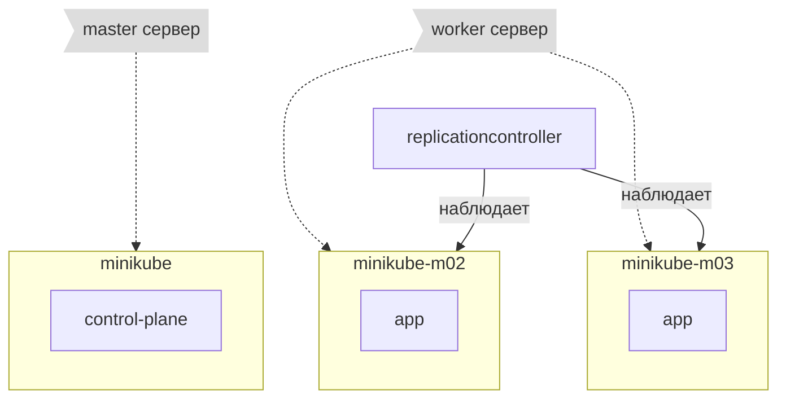

Кластер с одной головой и несколько workers
=================================================

- https://minikube.sigs.k8s.io/docs/tutorials/multi_node/
- https://habr.com/ru/company/flant/blog/572188/

Хочеться вот такое по серверам



Стартует

    🚀 minikube start

    🚀 eval $(minikube docker-env)

Какте есть узлы/сервера

    🚀 minikube node list
    minikube	192.168.49.2

    🚀 kubectl get node
    NAME       STATUS   ROLES           AGE     VERSION
    minikube   Ready    control-plane   2d21h   v1.26.1

Добавляем узел

    🚀 minikube node add --worker
    Adding node m02 to cluster minikube
    Cluster was created without any CNI, adding a node to it might cause broken networking.
    Starting worker node minikube-m02 in cluster minikube
    Скачивается базовый образ ...
    Creating docker container (CPUs=2, Memory=2200MB) ...
    Подготавливается Kubernetes v1.26.1 на Docker 20.10.23 ...
    Компоненты Kubernetes проверяются ...
    Successfully added m02 to minikube!

Добавляем еще узел

    🚀 minikube node add --worker
    Adding node m03 to cluster minikube
    Starting worker node minikube-m03 in cluster minikube
    Скачивается базовый образ ...
    Creating docker container (CPUs=2, Memory=2200MB) ...
    Подготавливается Kubernetes v1.26.1 на Docker 20.10.23 ...
    Компоненты Kubernetes проверяются ...
    Successfully added m03 to minikube!

Смотрим узлы

    🚀 kubectl get node
    NAME           STATUS   ROLES           AGE     VERSION
    minikube       Ready    control-plane   2d21h   v1.26.1
    minikube-m02   Ready    <none>          58s     v1.26.1
    minikube-m03   Ready    <none>          8s      v1.26.1

Смотрим службы

    🚀 kubectl get svc
    NAME             TYPE           CLUSTER-IP      EXTERNAL-IP     PORT(S)          AGE
    hello-minikube   NodePort       10.96.148.140   <none>          8080:31040/TCP   2d1h
    kubernetes       ClusterIP      10.96.0.1       <none>          443/TCP          2d21h
    kubia-svc        LoadBalancer   10.100.66.129   10.100.66.129   8080:30093/TCP   22h

Пересоздадим внешню службу

    🚀 kubectl delete -n default service kubia-svc

Магия для minikune, запускать в отдельном терминале

    🚀 minikube tunnel

Создаем службу заново, для доступа извне

    🚀  kubectl expose deployment kubia --type=LoadBalancer --name=kubia-svc
    service/kubia-svc exposed

Смотрим службы

    🚀 kubectl get svc
    NAME             TYPE           CLUSTER-IP      EXTERNAL-IP     PORT(S)          AGE
    hello-minikube   NodePort       10.96.148.140   <none>          8080:31040/TCP   2d1h
    kubernetes       ClusterIP      10.96.0.1       <none>          443/TCP          2d22h
    kubia-svc        LoadBalancer   10.100.183.15   10.100.183.15   8080:32683/TCP   4s

Теперь создание контроллера репликации

Создадим файл kubia-rc.yaml

```yaml
apiVersion: v1
kind: ReplicationController
metadata:
  name: kubia-rc
spec:
  replicas: 3
  selector:
    app: kubia
  template:
    metadata:
      name: kubia
      labels:
        app: kubia
    spec:
      containers:
      - name: kubia
        image: kubia:latest
        imagePullPolicy: Never
        ports:
        - containerPort: 8080
```

- `spec.selector` - по каким меткам находить экземпляр приложения
- `spec.replicas` - сколько экземпляров должно быть
- `spec.template` - шаблон pod

Применим файл

    🚀 kubectl apply -f kubia-rc.yaml 
    replicationcontroller/kubia-rc created

Смотрим pod

    🚀 kubectl get pod -o wide
    NAME                     READY   STATUS    RESTARTS      AGE     IP            NODE           NOMINATED NODE   READINESS GATES
    kubia-5b55b5c484-jdjqc   1/1     Running   1 (52m ago)   22h     10.244.0.24   minikube       <none>           <none>
    kubia-rc-8nlpt           1/1     Running   0             6m32s   10.244.2.2    minikube-m03   <none>           <none>
    kubia-rc-95nvz           1/1     Running   0             6m32s   10.244.2.3    minikube-m03   <none>           <none>
    kubia-rc-s5rjb           1/1     Running   0             6m32s   10.244.1.2    minikube-m02   <none>           <none>
