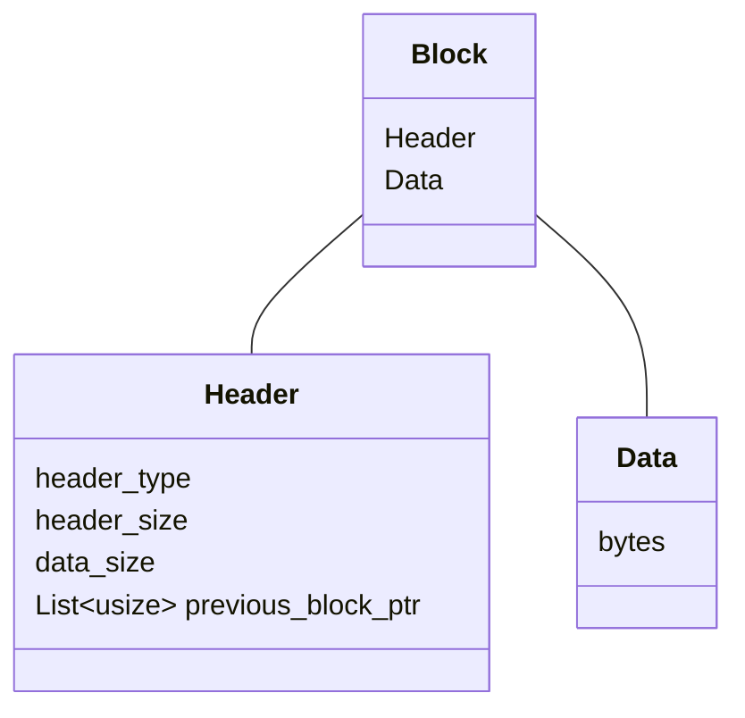

Лог файл
==============

Структура лога
----------------------------

Лог состоит из смеженных блоков

Очередной блок содержит ссылки на предыдущие блоки

Предыдущиз ссылок в блоке может быть несколько:

1. на предыдущий блок - те `текущий блок - 1`
2. на блок перед предыдущим - те `текущий блок - 2`
3. на блок пред, пред, пред - те `текущий блок - 4`
4. `текущий блок - 8`
5. `текущий блок - 16`

т.е. по степени 2

получается примерно такая картина

| № | смещение   | ссылка^0(-1) | ссылка^1(-2) | ссылка^2(-4) | ссылка^3(-8) | ссылка^4(-16) |
|---|------------|--------------|--------------|--------------|--------------|---------------|
| 0  | 0         | -            | -            | -            | -            | - |
| 1  | 10        | 0            | -            | -            | -            | - |
| 2  | 20        | 10           | 0            | -            | -            | - |
| 3  | 30        | 20           | -            | -            | -            | - |
| 4  | 40        | 30           | 10           | 0            | -            | - |
| 5  | 50        | 40           | -            | -            | -            | - |
| 6  | 60        | 50           | 30           | -            | -            | - |
| 7  | 70        | 60           | -            | -            | -            | - |
| 8  | 80        | 70           | 50           | 40           | 0            | - |
| 9  | 90        | 80           | -            | -            | -            | - |
| 10 | 100       | 90           | 70           | -            | -            | - |
| 11 | 110       | 100          | -            | -            | -            | - |
| 12 | 120       | 110          | 90           | 80           | -            | - |
| 13 | 130       | 120          | -            | -            | -            | - |
| 14 | 140       | 130          | 110          | -            | -            | - |
| 15 | 150       | 140          | -            | -            | -            | - |
| 16 | 160       | 150          | 130          | 120          | 80           | 0 |

Процедура записи в лог
---------------------------------

- Запись первого блока
- Запись второго блока
- Запись 3-го блока
- Запись 4-го блока
- Запись 5-го блока
- Запись 6-го блока
- Запись 7-го блока
- Запись 8-го блока
- Запись 9-го блока

|  N  | ссылка^0(-1) | ссылка^1(-2) | ссылка^2(-4) | ссылка^3(-8) | ссылка^4(-16) | операция |
| --- | ------------ | ------------ | ------------ | ------------ | ------------- |----|
| 0   | -            |              |              |              |               | вставка первой записи
| 1   | 0            |              |              |              |               | обвление ref#0
| 2   | 1            | 0            |              |              |               | обвление ref#0, ref#1
| 3   | 2            |              |              |              |               | обвление ref#0
| 4   | 3            | 2            | 0            |              |               | обвление ref#0, ref#1, #2
| 5   | 4            |              |              |              |               | обвление ref#0
| 6   | 5            | 4            |              |              |               | обвление ref#0, ref#1
| 7   | 6            |              |              |              |               | обвление ref#0
| 8   | 7            | 6            | 4            | 0            |               | обвление ref#0, ref#1, #2, #3
| 9   | 8            |              |              |              |               | обвление ref#0
| 10  | 8            | 8            |              |              |               | обвление ref#0
| 11  | 8            |              |              |              |               | обвление ref#0
| 12  | 8            | 10           | 8            |              |               | обвление ref#0
| 13  | 8            |              |              |              |               | обвление ref#0
| 14  | 8            | 12           |              |              |               | обвление ref#0
| 15  | 8            |              |              |              |               | обвление ref#0
| 16  | 8            | 14           | 12           | 8            | 0             | обвление ref#0
