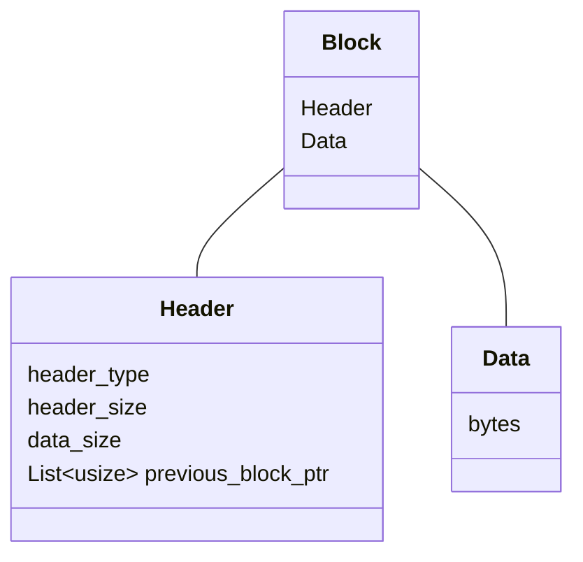
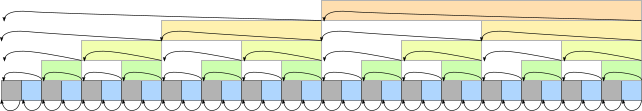

Лог файл
==============

Лог состоит из смеженных блоков

Очередной блок содержит ссылки на предыдущие блоки

Предыдущиз ссылок в блоке может быть несколько:

1. на предыдущий блок - те `текущий блок - 1`
2. на блок перед предыдущим - те `текущий блок - 2`
3. на блок пред, пред, пред - те `текущий блок - 4`
4. `текущий блок - 8`
5. `текущий блок - 16`

т.е. по степени 2

получается примерно такая картина

| № | смещение   | ссылка^0(-1) | ссылка^1(-2) | ссылка^2(-4) | ссылка^3(-8) | ссылка^4(-16) |
|---|------------|--------------|--------------|--------------|--------------|---------------|
| 0  | 0         | -            | -            | -            | -            | - |
| 1  | 10        | 0            | -            | -            | -            | - |
| 2  | 20        | 10           | 0            | -            | -            | - |
| 3  | 30        | 20           | -            | -            | -            | - |
| 4  | 40        | 30           | 10           | 0            | -            | - |
| 5  | 50        | 40           | -            | -            | -            | - |
| 6  | 60        | 50           | 30           | -            | -            | - |
| 7  | 70        | 60           | -            | -            | -            | - |
| 8  | 80        | 70           | 50           | 40           | 0            | - |
| 9  | 90        | 80           | -            | -            | -            | - |
| 10 | 100       | 90           | 70           | -            | -            | - |
| 11 | 110       | 100          | -            | -            | -            | - |
| 12 | 120       | 110          | 90           | 80           | -            | - |
| 13 | 130       | 120          | -            | -            | -            | - |
| 14 | 140       | 130          | 110          | -            | -            | - |
| 15 | 150       | 140          | -            | -            | -            | - |
| 16 | 160       | 150          | 130          | 120          | 80           | 0 |
