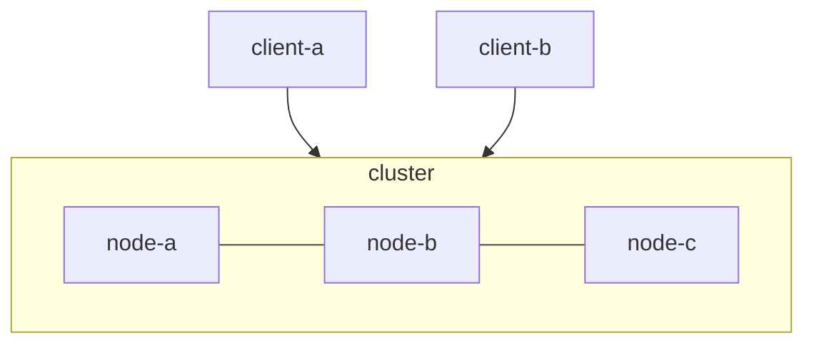
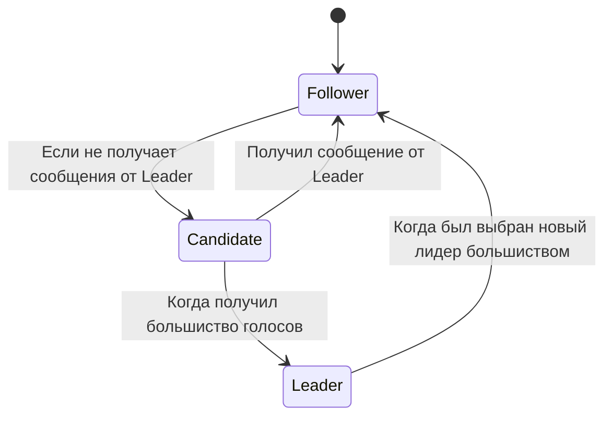
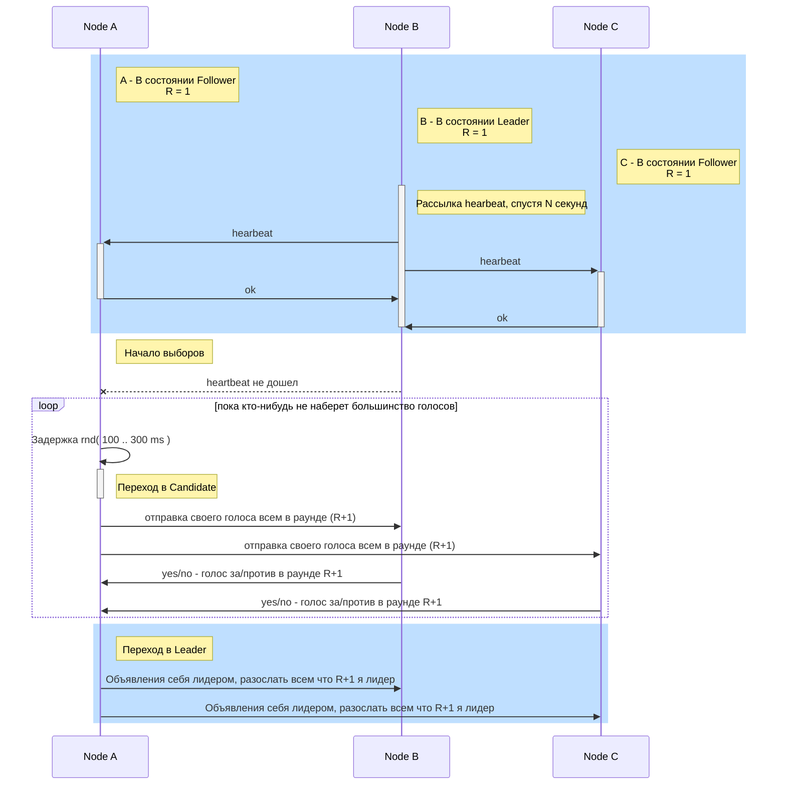
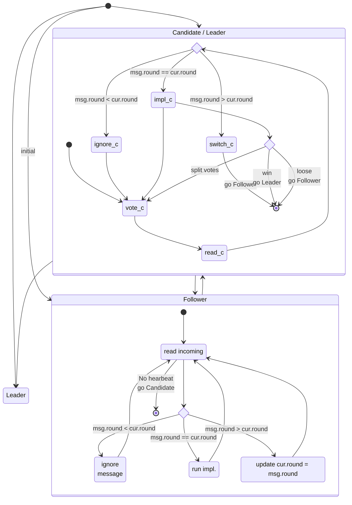

Кластерное приложение
==================================

Выбор лидера RAFT
=========================

Узел кластера может быть в одном из 3 состояний:

- **Leader** (лидер) - 
  обрабатывает все клиентские запросы, является source of truth всех данных в логе, поддерживает лог фоловеров.
- **Follower** (фоловер)
  пассивный сервер, который только «слушает» новые записи в лог от лидера и редиректит все входящие запросы от клиентов на лидера. По сути, является hot-standby репликой лидера.
- **Candidate** (кандидат)
  специальное состояние сервера, возможное только во время выбора нового лидера.

Во время нормальной работы в кластере только один сервер является лидером, все остальные – его фоловеры.

**Граф переходов состояния**

**Инициализация выбора лидера**

Коммуникация
---------------------------

- Каждый сервер отслеживает номер своего текущего срока(раунда).
- Сервер включает номер своего срока в каждое отправляемое сообщение.
- Если сервер получает сообщение с меньшим номером срока, чем его собственный, то он игнорирует это сообщение.
- Если сервер получает сообщение с бо́льшим номером срока, чем его собственный, то он обновляет свой номер срока, чтобы тот соответствовал полученному.
- Если кандидат или лидер получает сообщение с бо́льшим номером срока, чем его собственный, то он понимает, что другие сервера уже инициировали новый срок, а его срок более неактуален. Поэтому он переходит из текущего состояния в состояние «фоловер» вдобавок к обновлению своего номера.

**обработка номера раунда**

Коммуникация серверов. Серверы в Raft взаимодействуют посредством обмена запросами и ответами. Базовый алгоритм использует всего-навсего два вида вызовов:

- **RequestVote** используется кандидатами во время выборов. Запрос содержит номер срока кандидата и метаданные о логе кандидата, более подробно рассмотренные далее. Ответ содержит номер срока отвечающего сервера и значение «true», если сервер голосует за кандидата; «false», если сервер голосует против кандидата.
- **AppendEntries** используется лидером для репликации лога, а также для механизма heartbeat. Запрос содержит номер срока лидера, коллекцию записей, которые нужно добавить в лог (или пустую коллекцию в случае heartbeat), некоторые метаданные о логе лидера, также подробнее рассмотренные далее. Ответ содержит номер срока фоловера и значение «true», если фоловер успешно добавил записи в свой лог; «false», если добавить записи в лог не удалось.

Для инициации выборов фоловер инкрементит свой номер срока, переходит в состояние «кандидат», голосует сам за себя и затем рассылает запрос «RequestVote» всем остальным серверам. После этого кандидат ждёт одного из трёх событий:

- **Кандидат получает большинство голосов (включая свой) и побеждает в выборах**. Каждый сервер голосует в каждом сроке лишь единожды, за первого достучавшегося кандидата (с некоторым исключением, рассмотренным далее), поэтому набрать в конкретном сроке большинство голосов может только один кандидат. Победивший сервер становится лидером, начинает рассылать heartbeat и обслуживать запросы клиентов к кластеру.
- **Кандидат получает сообщение от уже действующего лидера текущего срока или от любого сервера более старшего срока**. В этом случае кандидат понимает, что выборы, в которых он участвует, уже не актуальны. Ему не остаётся ничего, кроме как признать нового лидера/новый срок и перейти в состояние фоловер.
- **Кандидат не получает за некоторый таймаут большинство голосов**. Такое может произойти в случае, когда несколько фоловеров становятся кандидатами, и голоса разделяются среди них так, что ни один не получает большинства. В этом случае срок заканчивается без лидера, а кандидат сразу же начинает новые выборы на следующий срок

Реплицируем логи
===========================

Когда лидер выбран, на него ложится ответственность за управление распределённым логом. Лидер принимает от клиентов запросы, содержащие некоторые команды. Лидер кладёт в свой лог новую запись, содержащую команду, а затем отсылает «AppendEntries» всем фоловерам, для того чтобы отреплицировать запись с новой записью.

Когда запись будет успешно разреплицирована на большинстве серверов, лидер начинает считать запись закоммиченой и отвечает клиенту. Лидер следит за тем, какая запись является последней. Он отправляет номер этой записи в AppendEntries (включая heartbeat), чтобы фоловеры могли закоммитить запись у себя.

В случае, если лидер не может достучаться до некоторых фоловеров, он будет ретраить AppendEntries до бесконечности.

