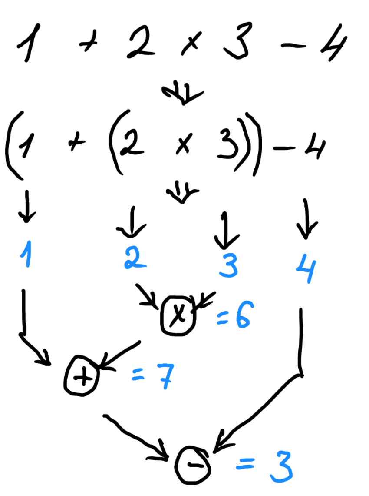

# Правила грамматики

Рассмотрели нижний уровень - парсинг лексем.

Принципиально лексема от буквы отличается, только более крупным составом

Рассмотрели графический способ определение грамматики, но он был дан в не полном составе

Важная концепция что правило грамматики это функция которая по указателю на исходник распознает текст

Графический код хорош, но мышкой писать код... так себе.

Есть другие способы задания грамматик

# 4 Типа грамматик Хомского

В общем случае грамматики определяют правила/ функции перевода текста с одного языка в другой

Например так: **вася → Вася**

Здесь переводиться слово из нижнего регистра в верхний

Хомский, выделил 4 принципиальных грамматики

**Грамматика 0** - не ограничено, т.е. любые тексты до стрелки (Левая часть) может быть любой (непустой) и правая часть (после стрелки)

**Грамматики 1-** контекстно-зависимые, где перевод зависит от контекста

**Грамматики 2-** контекстно-свободные, где правила перевода уже не зависят от контекста. Именно этот тип грамматик будет рассмотрен далее

**Грамматики 3** типа - регулярные, в целом к этим грамматикам можно отнести лексер.

В общем виде грамматика по Хомскому это вот такие правила.

ab **C** de → ab **FG** de

Замена символа/ов в левой части (С) на символы в правой части (FG)

# Формальные грамматики

Вот например диаграмма SQL синтаксиса запроса

На этой диаграмме характерны некоторые узлы:

- Есть один вход и один выход  
- **Ключевые слова** заданы прямоугольником с острыми углами  
- Части которые большие выделены в отдельные диаграммы - правила, им даны имена и даны ссылки на них в прямоугольниках с закругленными краями  
- Есть циклы в виде обратных петель  
- Есть опциональные значения - это развилки, которые просто проходят мимо  
- Есть несколько альтернатив, когда путь имеет развилки

Формально грамматическое правило можно (и нужно) определить как псевдокод именной функции, где имя функции совпадает с именем правила

На предыдущей диаграмме были выделены ключевые слова и именованные конструкции

В формальной теории выделяют два ключевых понятия

**Терминалы** - это примитивные конструкции которые не могут быть разложены на более примитивные

В нашем случае с Лексером это цифры, пробелы, операторы и скобки

**НеТерминалы** - Это конструкции которые как то состоят как из терминалов, так и из нетерминалов

В примере с лексером это Число, которое состоит из цифр

Вообще удобно сопоставить НеТерминал с конкретной функцией-парсер (сигнатура `Optional<Token> parse (pointer)`)

В контекстно-свободных грамматиках (Грамматики 2-го типа) правила парсинга можно записать так:

В грамматике Хомского:

1. Число → Целая_часть Точка Дробная_часть Число → Точка Дробная_часть  
2. Число → Целая_часть Дробная_Часть  
3. Число → Целая_часть  
4. Целая_часть → Цифра Целая_часть  
5. Целая_часть → Цифра  
6. Дробная_часть → Цифра Дробная_Часть  
7. Дробная_часть → Цифра  
8. Цифра → 0  
9. Цифра → 1  
10. Цифра → 2  
11. Цифра → 3  
12. Цифра → 4  
13. Цифра → 5  
14. Цифра → 6  
15. Цифра → 7  
16. Цифра → 8  
17. Инфра → 9  
18. Точка → .

В данном случае правила выглядят избыточно

Если рассмотреть что это функции, то можно увидеть рекурсию:

**Целая-часть** → Цифра **Целая-часть**

Рекурсия здесь используется для организации циклов

Условием выхода из рекурсии - это альтернативный вариант

Целая-часть → Цифра

Рассмотрим парсинг строки согласно данной грамматике

Тут на диаграмме в кругах показаны какие правила срабатывают

# **Бэкуса - Наура Форма**

e(xtended) BNF - Расширенная форма Бэнуса-Наура - это достаточно типичная форма записи контекстно-свободных грамматик Хомского

Общая форма такая

    Имя правила ::= Содержание

- **Имя правила** - это функция парсинга. Обычно в рамках этой формы есть только одна функция с этим именем, другие функции имеют другие имена  
- **Содержание** - это код парсинга

## Последовательность

Содержание может быть одна или несколько конструкций

Терминальные символы/текст заключаются в кавычки

Например: правило определяющее ключевое слово IF

    IF ::= 'if'

Последовательность конструкций распознаются в той же последовательности, что и в правиле, например IF может быть переписано в равнозначную конструкцию

    IF ::= 'i' 'f'

Данная конструкция компилируется в примерно такой код

    parse (ptr) {  
        if (ptr.get() !='i') return not parse
        dptr = ptr. move (1)
        
        if (ptr.get() !='f') return not parse
        dptr = ptr. move (1)
        
        return successfully parsed  
    }

## Ветвления / альтернативы

В примере выше есть такая часть правил

     8. Цифра → 0  
     9. Цифра → 1  
     10. Цифра → 2  
     11. Цифра → 3  
     12. Цифра → 4  
     13. Цифра → 5  
     14. Цифра → 6  
     15. Цифра → 7  
     16. Цифра → 8  
     17. Инфра → 9

Данные набор правил сокращаются в такую форму

    Цифра ::= '0'|'1'|'2'|'3'|'4'|'5'|'6'|'7'|'8'|'9'

Вертикальная линия указывает что есть другой вариант

Данная конструется компилируется в набор if конструкций, примерно так

    parse (ptr) {  
        if (ptr.get() =='0') return success   
        else if (ptr.get() =='1') return success   
        else if (ptr.get() =='2') return success   
        else if (ptr.get() =='3') return success  
        else if (ptr.get() =='4') return success  
        else if (ptr.get() =='5') return success  
        else if (ptr.get() =='6') return success  
        else if (ptr.get() =='7') return success  
        else if (ptr.get() =='8') return success  
        else if (ptr.get() =='9') return success
        return fail
    }

## Циклы

Допускаются как и рекурсии, так и циклы

Например: целое число можно описать так

    Цело_число ::= Цифра {Цифра}

В фигурных скобках указывается код, который может быть повторен 0 или более раз

Код в примере компилируется в такой код:

    int_number (ptr) {  
        var (result, next_ptr) = digit (ptr)  
        if ( result == fail ) return fail  
        ptr = next_ptr  

        while (true) {  
            var (result, next_ptr) = digit (ptr)  
            if ( result == fail ) break  
            ptr = next_ptr  
        }

        return success
    }

Возможная Рекурсия в данном случае это вызов другой функции → digit (ptr)

## Опциональные значения

Это частный случай цикла, где количество повторов может быть 0 или 1

Вместо фигурных скобок используются квадратные

Пример

    Число ::= Целая_часть Точка Дробная_часть
            | Целая_часть Точка
            | Точка Дробная_часть
            | Целая_часть

Может быть переписано в такую форму

    Число::= Целая_часть [ Точка [ Дробная_часть ] ]
           | Точка [ Дробная_часть ]

## Группировка

Для группировки используется круглые скобки и используются в том же смысле, что и в обычной арифметике - для указания группы действий

## Пробельные символы в грамматике

Допустим у нас будет правило сложения

    Сложение ::= Число '+' Число

Такое правило не допускает пробелов между оператором + и числами, тогда правило необходимо переписать

    Сложение ::= Число {пробел} '+' {пробел} Число

Но часто модифицируют лексер так, чтобы именно пробелов не было в результатах, как и комментариев

И тогда нет необходимости в явной форме указывать пробелы и комментарии

# **Грамматика Арифметики**

Цель грамматики - построить дерево выполнения вычисления

Пример

В данном случае как и с лексером функции parser должны возвращать узлы дерева

Общий вид таких функций: `Optional<Ast> parse(pointer)`

Есть следующие изменения:

- **pointer** итерируется не по символам строки, а по списку лексем  
- **Ast** ссылается так ссылается на pointer (Token) → pointer (Source: string, offset: int)

Ast (Abstract Syntax Tree) - это некий абстрактный interface, с следующими методами:

- `begin(): Pointer` - указатель на лексему начала конструкции  
- `end(): Pointer` - указатель на конец конструкции

У которого есть такие дочерние классы

- `Add {` - операция сложения  
  - `left (): Ast` - левый операнд  
  - `right(): Ast` - правый операнд  
- `Sub {` - операция вычитания  
  - `left (): Ast` - левый операнд  
  - `right(): Ast`- правый операнд  
- `Mult {` - операция умножения  
  - `left (): Ast` - левый операнд  
  - `right(): Ast`- правый операнд  
- `Div {` - операция деления  
  - `left (): Ast` - левый операнд  
  - `right(): Ast`- правый операнд  
- `UnaryPlus {` - унарный плюс  
  - `value (): Ast` - операнд  
- `UnaryMinus {` - унарный минус  
  - `value (): Ast` - операнд  
- `Atom {` - число  
  - `value(): NumToken` - лексема числа

То же дерево должно превратится в следующее дерево AST

Грамматика без учета приоритетов

    Ast ::= Atom { ( '+' | '-' | '*' | '/') Atom }

Если попробовать такую грамматику, то получим такое дерево

Грамматика с учетом приоритетов

Синими стрелками отображена примерная последовательность парсинга

Все хорошо кроме вот такой конструкции: `1*(2+3)/4`

- Споткнется на скобках - их нет в грамматике  
- Конструкции в скобках имеют больший приоритет

## Рекурсивная грамматика арифметики

Здесь уже отмечен рекурсивный вызов желтым блоком

Код парсера должен быть примерно таким согласно грамматике

    Optional<Ast> parseAst(pointer)
    Optional<Ast> parseSum(pointer)
    Optional<Ast> parseMul(pointer)
    Optional<Ast> parseAtom(pointer)

Выше уже обсуждалось как конкретное правило - грамматика компилируется уже в код

Рассмотрим в виде диаграммы одно правило

# **Левая рекурсия**

Левая рекурсия - это такое правило или группа правил которые ведут к бесконечным рекурсиям

Пример

**Sum** ::= Mul { ( '+' | '-' ) Sum }

Mul ::= Atom { ( '*' | '/' ) Atom }

Atom ::= **Sum** | NumToken

Тут правило Sum рекурсивно вызывается в Atom самым первым не потребив ни одной лексемы, получается что алгоритм впадет в бесконечный цикл

Есть формальный алгоритм модификации грамматики так, чтобы не было левой рекурсии, но при этом исходный синтаксис конечной программы не изменился на практике

# **Унарные операции**

Грамматику унарной операции легко добавить, тут надо определиться с приоритетом операций

1. Унарные операции наивысший приоритет, наравне со скобками  
2. Умножение, деление  
3. Сложение, вычитание

Тогда это должно быть так

Хотя могут быть и другие варианты

# **Вычисления**

Вычисления это по сути проход по дереву AST от корня к листьям

Последовательность выделена шагами от 1 до 33