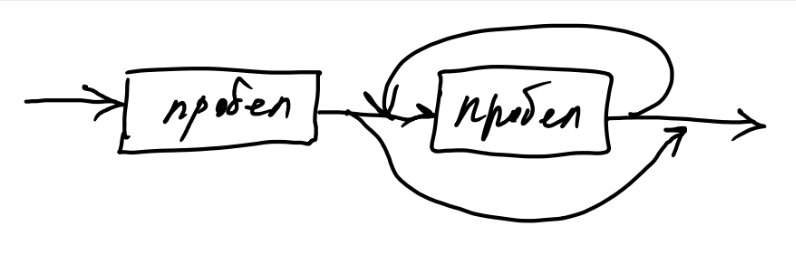
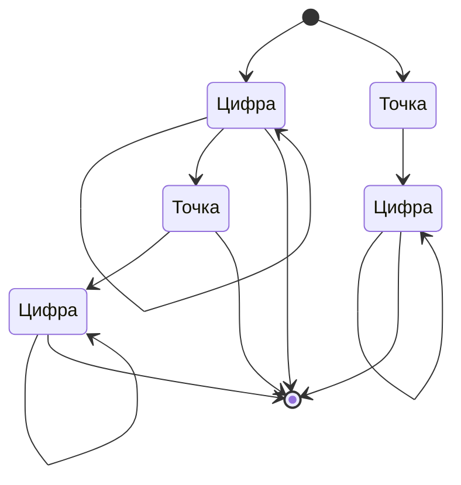
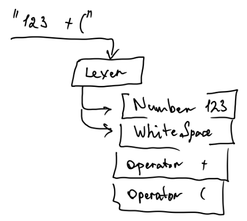

# **Синтаксис**

Не любая последовательность символов, а только определенная последовательность согласно набору правил является нашим языком.

Набор правил - они же парсеры, они же алгоритмы в данном случае и будут **синтаксисом**.

**Синтаксис** - это набор иерархических правил, которые (рекурсивно) ссылаются на другие правила.

Начнем с нижнего уровня, с лексем.

**Лексема** - это минимальная единица языка из которых складываются предложение

Перечислим лексемы нашего языка:

- Пробел (ы)  
- Скобки  
- Числа  
- Операторы

Для языков программирования выделяют отдельный класс функций - Лексер

В общем случае задача лексер на вход получаем поток символов или текстовый файл \+ указатель на позицию в файле

На выходе лексер возвращает:

- Лексему  
- Указатель на символы следующие за лексемой

Либо возвращает ошибку

Грубо **указатель** можно описать таким классом:

```java
class Pointer {  
   String filename ();  
   int line ();  
   int posInLine ();      // Инфа - куда, на какой символ, файл указывает указатель, т.е. исходник.  
   Optional<char> get (); // чтение символа  
   boolean isЕOF();       // указатель может оказаться за пределами файла  
   Pointer move (int offset); // Перемещение - создание нового указателя, 
                              // со смещением в кол-ве символов относительно текущего  
}
```
_См. [полный исходный код](src/main/java/org/example/grammar/math/Pointer.java)_

Лексему можно описать такими: классами

```java
interface Token {  
   Pointer begin();  
   Pointer end();  
}
```

_См. [полный исходный код](src/main/java/org/example/grammar/math/lex/Token.java)_

Token - она же лексема, имеет два метода указывающие на начало и конец в исходном тексте

      class WhitespaceToken implements Token {}

Пробелы как лексема не имеют в себе полезной нагрузки, вынесение этой лексемы в отдельный класс нужно чтобы отделить эту лексему от операторов:

      assertTrue(token instance of WhitespaceToken)

Комментарий: оператор instanceof (Java) возвращает true/false в зависимости к какому классу/типу данных относиться ссылка

      class NumberToken implements Token {Num value ();}

Лексема числа например имеет полезную нагрузку: метод value ()

Операторы и скобы принципиально не отличаются по реализации от пробела

      class PlusToken implements Token {}  
      class MinusToken implements Token {}  
      class MultiplyToken implements Token {}  
      class DivisionToken implements Token {}  
      class OpenBracketToken implements Token {}  
      class CloseBracketToken implements Token {}

## Парсинг операторов

Операторы состоят из одного символа, код парсинга их примитивен

```java
Optional<Token> parsePlus (Pointer ptr) {  
      Optional<Character> chrOpt = ptr.get();  
      if( сhrOpt.map(с -> с=='+').orElse(false))
          return Optional.empty();  
      return Optional.of(new PlusToken(ptr,ptr.move(1) ));  
}
```

Суть такая:

1. Получить очередной символ по указателю или „пустое" значение.  
2. Если символ не является оператором или получено „пусто", то возвращаем „пустое" значение  
3. Иначе возвращаем лексему с указанием её расположения в исходном коде

_См. [полный исходный код](src/main/java/org/example/grammar/math/lex/PlusToken.java#L18)_

## **Парсинг пробелов**



Пробелы состоят из одного или более символов, и код парсера не сильно отличается от предыдущего:

1. Получить очередной символ  
   - Если пробел, то перейти к следующему шагу (2)  
   - Иначе завершить с пустым значением  
2. Получить очередной символ  
   - Если пробел, то повтор шага (2)  
   - Иначе завершить с тем, что накопилось

_См. [полный исходный код](src/main/java/org/example/grammar/math/lex/WhiteSpaceToken.java#L18)_

Здесь не указано, но под словом "очередной" - выполняется операция сдвига указателя

Условно алгоритм можно изобразить как на диаграмме выше

Стрелки обозначают переход от одного ожидаемого символа к другому

Для таких диаграмм характерно

- Есть только одна входящая стрелка

Вот так это выглядит в коде

```java
public class WhiteSpaceToken extends AbstractToken {
   public WhiteSpaceToken(Pointer.CharPointer begin, Pointer.CharPointer end) {
      super(begin, end);
   }

    /**
     * Парсер лексемы
     */
    public static final TokenParser parser = ptr ->
    {
       Pointer.CharPointer ptrBegin = ptr;

       // Проверка первого пробела
       Optional<Pointer.CharPointer> next = ptr.get().flatMap(c -> c == ' '
            ? Optional.of(ptrBegin.move(1))
            : Optional.empty()
        );

        if( next.isEmpty() )return Optional.empty();
        
       // Получаем указатель на следующий возможный пробел
       ptr = next.get();

       // Проверка очередного пробела
        while (true){
            var fptr2 = ptr;
            var next2 = ptr.get().flatMap(c -> c == ' '
                ? Optional.of(fptr2.move(1))
                : Optional.empty()
            );

            if( next2.isEmpty() )break;
            ptr = next2.get();
        }

        return Optional.of(
            new WhiteSpaceToken(ptrBegin, ptr)
        );
    };
}
```

## Парсинг чисел



На этой диаграмме число представлено как несколько возможных варианта

1. **цифра** (мин 1 символ)  
2. **цифра** (мин 1 символ) **точка цифра** (мин 0 символов)
3. **точка цифра** (мин 1 символ)

_См. [полный исходный код](src/main/java/org/example/grammar/math/lex/NumToken.java)_

## **Общий пирсинг лексем**

В целом должно получиться 3 парсера - 3 метода с одной общей сигнатурой

      Optional<Token> parseOperator(Pointer ptr)
      Optional<Token> parseWhiteSpace(Pointer ptr)
      Optional<Token> parseNumber (Pointer ptr)

Все эти 3 парсера объединяются в один, который

1. Проверяет исходный текст (ptr) очередным парсером  
   - Если лексема была распознана, тогда она возвращается, а другие варианты не рассматриваются  
   - Если все варианты рассмотрены, то возвращается пустое значение

Обычно общий парсинг может двигаться от одной лексемы к следующей до конца исходного текста

- Движение может происходить по мере надобности  
- Либо взять весь исходный текст и выделить все лексемы до конца файла, либо до ошибки

В общем выглядит так:



```java
 public static final TokenParser parser = ptr ->
     WhiteSpaceToken.parser.parseToken(ptr)
         .or(() -> NumToken.parser.parseToken(ptr))
         .or(() -> CloseParenthesesToken.parser.parseToken(ptr))
         .or(() -> OpenParenthesesToken.parser.parseToken(ptr))
         .or(() -> PlusToken.parser.parseToken(ptr))
         .or(() -> MinusToken.parser.parseToken(ptr))
         .or(() -> MultiplyToken.parser.parseToken(ptr))
         .or(() -> DivisionToken.parser.parseToken(ptr))
     ;
```

_См. [полный исходный код](src/main/java/org/example/grammar/math/lex/MathTokenParser.java)_