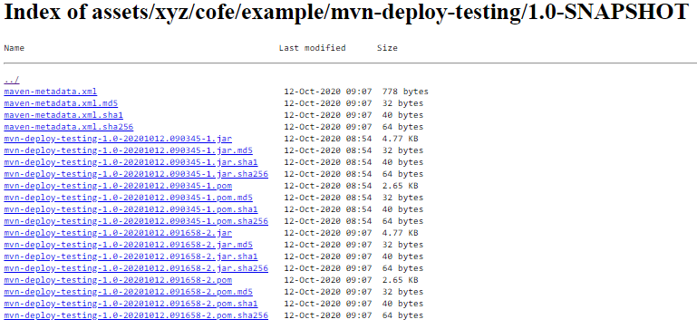
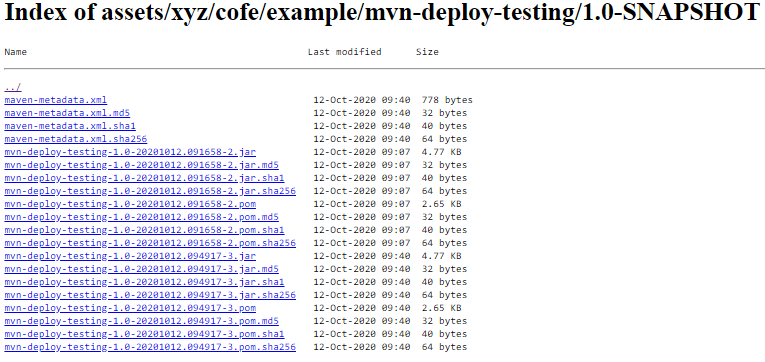

Демонстрация maven SNAPSHOT
==============================

1. Предварительная настройка
    1. Установить java 8 если еще не установлена
    2. Установить maven 3.5+ если еще не установлен
    3. Скопировать settings.xml и изменить
2. Базовый проект
    1. Изменить pom.xml
    1. Запустить deploy
3. Зависимый проект
    1. Изменить pom.xml
    1. скомпилировать ____
    2. запустить ____
    
settings.xml
----------------------------

[Файл с шаблон settings.xml](settings.xml)

В файле должно быть указано

- Расположение локального репозитория `settings/localRepository`
- Логины/пароли `settings/servers/server`, [про шифрование паролей](http://cofe.xyz/itdocs/maven/docs/maven-config.html)
- Активный профиль (в шаблоне указан `settings/profiles/profile/id=profile-id-artifactory`) с содержанием:
    - Репозитории для snapshot сборок
    - Репозитории для release сборок
    - Репозитории для maven-central
    - Репозитории для плагинов pluginRepositories (не уверен что обязательно)
    - Плагин должен быть активен

Для проекта создан репозиторий

* имя **repo-name**
* url http://repo-server-ip-or-dns:8081/artifactory/repo-name
* может содержать snapshot сборки, макс уникальных  - 2 (см ниже)

Базовый проект
----------------------------

### pom.xml

В pom.xml должно быть указанно:

- Координаты groupId, artifactId, version, packaging
- properties
    - maven.compiler.target
    - maven.compiler.source
    - project.build.sourceEncoding
    - project.reporting.outputEncoding
- distributionManagement
    - Репозитории для release и snapshot сборок, 
      допускается, что они будут указывать на один и тот же url
      
Пример

```xml
<project>
    <modelVersion>4.0.0</modelVersion>
    ...

    <!-- Координаты -->
    <groupId>xyz.cofe.example</groupId>
    <artifactId>mvn-deploy-testing</artifactId>
    <version>1.0-SNAPSHOT</version>
    <packaging>jar</packaging>

    ...
    <properties>
        <maven.compiler.target>1.8</maven.compiler.target>
        <maven.compiler.source>1.8</maven.compiler.source>
        <project.build.sourceEncoding>UTF-8</project.build.sourceEncoding>
        <project.reporting.outputEncoding>UTF-8</project.reporting.outputEncoding>

        <!-- Переменная timestamp будет содержать дату/время сборки -->
        <timestamp>${maven.build.timestamp}</timestamp>

        <!-- Дата/время сборки будет указана в этом формате -->
        <maven.build.timestamp.format>yyyy-MM-dd HH:mm:ss</maven.build.timestamp.format>
    </properties>
    ...

    <!-- Указываем репозитории в которые будем производить deploy -->
    <distributionManagement>
        <repository>
            <id>repo-server-releases-id</id>
            <name>libs-release</name>
            <url>http://repo-server-ip-or-dns:8081/artifactory/repo-name</url>
        </repository>
        <snapshotRepository>
            <id>repo-server-snapshots-id</id>
            <name>libs-snapshot</name>
            <url>http://repo-server-ip-or-dns:8081/artifactory/repo-name</url>
        </snapshotRepository>
    </distributionManagement>
    ...
</project>
```

### Базовый проект - deploy

    os-username@os-machine-name C:\Users\os-username\code\backend\samples\maven-deploy
    # set JAVA_HOME=C:\Program Files\Java\jdk1.8.0_211
    
    os-username@os-machine-name C:\Users\os-username\code\backend\samples\maven-deploy
    # set PATH=C:\apps\apache-maven-3.5.2\bin;%PATH%
    
    os-username@os-machine-name C:\Users\os-username\code\backend\samples\maven-deploy
    # cd mvn-deploy-testing
    
    os-username@os-machine-name C:\Users\os-username\code\backend\samples\maven-deploy\mvn-deploy-testing
    # mvn -s C:\Users\os-username\code\backend-maven-setting\settings.xml clean compile deploy
    [INFO] Scanning for projects...
    [INFO]
    [INFO] ------------------------------------------------------------------------
    [INFO] Building mvn-deploy-testing 1.0-SNAPSHOT
    [INFO] ------------------------------------------------------------------------
    [INFO]
    [INFO] --- maven-clean-plugin:2.5:clean (default-clean) @ mvn-deploy-testing ---
    [INFO] Deleting C:\Users\os-username\code\backend\samples\maven-deploy\mvn-deploy-testing\target
    [INFO]
    [INFO] --- maven-resources-plugin:2.6:resources (default-resources) @ mvn-deploy-testing ---
    [INFO] Using 'UTF-8' encoding to copy filtered resources.
    [INFO] Copying 1 resource
    [INFO] Copying 0 resource
    [INFO]
    [INFO] --- maven-compiler-plugin:3.1:compile (default-compile) @ mvn-deploy-testing ---
    [INFO] Changes detected - recompiling the module!
    [INFO] Compiling 1 source file to C:\Users\os-username\code\backend\samples\maven-deploy\mvn-deploy-testing\target\classes
    [INFO]
    [INFO] --- maven-resources-plugin:2.6:resources (default-resources) @ mvn-deploy-testing ---
    [INFO] Using 'UTF-8' encoding to copy filtered resources.
    [INFO] Copying 1 resource
    [INFO] Copying 0 resource
    [INFO]
    [INFO] --- maven-compiler-plugin:3.1:compile (default-compile) @ mvn-deploy-testing ---
    [INFO] Nothing to compile - all classes are up to date
    [INFO]
    [INFO] --- maven-resources-plugin:2.6:testResources (default-testResources) @ mvn-deploy-testing ---
    [INFO] Using 'UTF-8' encoding to copy filtered resources.
    [INFO] skip non existing resourceDirectory C:\Users\os-username\code\backend\samples\maven-deploy\mvn-deploy-testing\src\
    test\resources
    [INFO]
    [INFO] --- maven-compiler-plugin:3.1:testCompile (default-testCompile) @ mvn-deploy-testing ---
    [INFO] Nothing to compile - all classes are up to date
    [INFO]
    [INFO] --- maven-surefire-plugin:2.12.4:test (default-test) @ mvn-deploy-testing ---
    [INFO] No tests to run.
    [INFO]
    [INFO] --- maven-jar-plugin:2.4:jar (default-jar) @ mvn-deploy-testing ---
    [INFO] Building jar: C:\Users\os-username\code\backend\samples\maven-deploy\mvn-deploy-testing\target\mvn-deploy-testing
    -1.0-SNAPSHOT.jar
    [INFO]
    [INFO] --- maven-install-plugin:2.4:install (default-install) @ mvn-deploy-testing ---
    [INFO] Installing C:\Users\os-username\code\backend\samples\maven-deploy\mvn-deploy-testing\target\
    mvn-deploy-testing-1.0-SNAPSHOT.jar to C:\Users\os-username\code\backend\samples\maven-deploy\usr-os-username\repo\xyz\cofe\
    example\mvn-deploy-testing\1.0-SNAPSHOT\mvn-deploy-testing-1.0-SNAPSHOT.jar
    [INFO] Installing C:\Users\os-username\code\backend\samples\maven-deploy\mvn-deploy-testing\pom.xml to C:\Users\os-username\
    code\backend\samples\maven-deploy\usr-os-username\repo\xyz\cofe\example\mvn-deploy-testing\1.0-SNAPSHOT\
    mvn-deploy-testing-1.0-SNAPSHOT.pom
    [INFO]
    [INFO] --- maven-deploy-plugin:2.7:deploy (default-deploy) @ mvn-deploy-testing ---
    Downloading from repo-name-snapshots: http://repo-server-ip-or-dns:8081/artifactory/repo-name/xyz/cofe/example/mvn-deploy-testing/
    1.0-SNAPSHOT/maven-metadata.xml
    Downloaded from repo-name-snapshots: http://repo-server-ip-or-dns:8081/artifactory/repo-name/xyz/cofe/example/mvn-deploy-testing/
    1.0-SNAPSHOT/maven-metadata.xml (778 B at 1.6 kB/s)
    Uploading to repo-name-snapshots: http://repo-server-ip-or-dns:8081/artifactory/repo-name/xyz/cofe/example/mvn-deploy-testing/
    1.0-SNAPSHOT/mvn-deploy-testing-1.0-20201012.091658-2.jar
    Uploaded to repo-name-snapshots: http://repo-server-ip-or-dns:8081/artifactory/repo-name/xyz/cofe/example/mvn-deploy-testing/
    1.0-SNAPSHOT/mvn-deploy-testing-1.0-20201012.091658-2.jar (4.9 kB at 1.8 kB/s)
    Uploading to repo-name-snapshots: http://repo-server-ip-or-dns:8081/artifactory/repo-name/xyz/cofe/example/mvn-deploy-testing/
    1.0-SNAPSHOT/mvn-deploy-testing-1.0-20201012.091658-2.pom
    Uploaded to repo-name-snapshots: http://repo-server-ip-or-dns:8081/artifactory/repo-name/xyz/cofe/example/mvn-deploy-testing/
    1.0-SNAPSHOT/mvn-deploy-testing-1.0-20201012.091658-2.pom (2.7 kB at 9.3 kB/s)
    Downloading from repo-name-snapshots: http://repo-server-ip-or-dns:8081/artifactory/repo-name/xyz/cofe/example/mvn-deploy-testing/
    maven-metadata.xml
    Downloaded from repo-name-snapshots: http://repo-server-ip-or-dns:8081/artifactory/repo-name/xyz/cofe/example/mvn-deploy-testing/
    maven-metadata.xml (381 B at 3.9 kB/s)
    Uploading to repo-name-snapshots: http://repo-server-ip-or-dns:8081/artifactory/repo-name/xyz/cofe/example/mvn-deploy-testing/
    1.0-SNAPSHOT/maven-metadata.xml
    Uploaded to repo-name-snapshots: http://repo-server-ip-or-dns:8081/artifactory/repo-name/xyz/cofe/example/mvn-deploy-testing/
    1.0-SNAPSHOT/maven-metadata.xml (778 B at 1.6 kB/s)
    Uploading to repo-name-snapshots: http://repo-server-ip-or-dns:8081/artifactory/repo-name/xyz/cofe/example/mvn-deploy-testing/
    maven-metadata.xml
    Uploaded to repo-name-snapshots: http://repo-server-ip-or-dns:8081/artifactory/repo-name/xyz/cofe/example/mvn-deploy-testing/
    maven-metadata.xml (326 B at 1.2 kB/s)
    [INFO] ------------------------------------------------------------------------
    [INFO] BUILD SUCCESS
    [INFO] ------------------------------------------------------------------------
    [INFO] Total time: 7.083 s
    [INFO] Finished at: 2020-10-12T14:17:02+05:00
    [INFO] Final Memory: 18M/211M
    [INFO] ------------------------------------------------------------------------
    
После успешного deploy на сервере должны появиться файлы сборки, 
смотрим http://repo-server-ip-or-dns:8081/artifactory/repo-name/xyz/cofe/example/mvn-deploy-testing/1.0-SNAPSHOT/



Зависимый проект
-------------------------

### Зависимый проект - компиляция

     mvn -s C:\Users\os-username\code\backend-maven-setting\settings-os-username-v2.xml compile
     
В логе должно отобразиться

    [INFO] ------------------------------------------------------------------------
    [INFO] BUILD SUCCESS
    [INFO] ------------------------------------------------------------------------
    [INFO] Total time: 28.094 s
    [INFO] Finished at: 2020-10-12T14:39:04+05:00
    [INFO] Final Memory: 16M/147M
    [INFO] ------------------------------------------------------------------------

### Запуск проекта с зависимостями

     mvn -s C:\Users\os-username\code\backend-maven-setting\settings-os-username-v2.xml exec:java
     
В логе будет

    [INFO] Building mvn-dep-testing 1.0-SNAPSHOT
    [INFO] ------------------------------------------------------------------------
    Downloading from repo-name-snapshots: http://repo-server-ip-or-dns:8081/artifactory/repo-name/xyz/cofe/
    example/mvn-deploy-testing/1.0-SNAPSHOT/maven-metadata.xml
    Downloaded from repo-name-snapshots: http://repo-server-ip-or-dns:8081/artifactory/repo-name/xyz/cofe/
    example/mvn-deploy-testing/1.0-SNAPSHOT/maven-metadata.xml (778 B at 3.1 kB/s)

    show dep
    hello, group=xyz.cofe.example artifact=mvn-deploy-testing version=1.0-SNAPSHOT 
    buildTime=2020-10-12 09:16:55
    [INFO] ------------------------------------------------------------------------
    [INFO] BUILD SUCCESS
    [INFO] ------------------------------------------------------------------------
    
Обновление базового проекта
-----------------------------

Обновление базового проекта выполняется обычно `mvn deploy`

    mvn -s C:\Users\os-username\code\backend-maven-setting\settings.xml clean compile deploy
    
В логе будет

    [INFO] --- maven-deploy-plugin:2.7:deploy (default-deploy) @ mvn-deploy-testing ---
    Downloading from repo-name-snapshots: http://repo-server-ip-or-dns:8081/artifactory/repo-name/xyz/cofe/example/mvn-deploy-testing/
    1.0-SNAPSHOT/maven-metadata.xml
    Downloaded from repo-name-snapshots: http://repo-server-ip-or-dns:8081/artifactory/repo-name/xyz/cofe/example/mvn-deploy-testing/
    1.0-SNAPSHOT/maven-metadata.xml (778 B at 2.8 kB/s)
    Uploading to repo-name-snapshots: http://repo-server-ip-or-dns:8081/artifactory/repo-name/xyz/cofe/example/mvn-deploy-testing/
    1.0-SNAPSHOT/mvn-deploy-testing-1.0-20201012.094917-3.jar
    Uploaded to repo-name-snapshots: http://repo-server-ip-or-dns:8081/artifactory/repo-name/xyz/cofe/example/mvn-deploy-testing/
    1.0-SNAPSHOT/mvn-deploy-testing-1.0-20201012.094917-3.jar (4.9 kB at 1.3 kB/s)
    Uploading to repo-name-snapshots: http://repo-server-ip-or-dns:8081/artifactory/repo-name/xyz/cofe/example/mvn-deploy-testing/
    1.0-SNAPSHOT/mvn-deploy-testing-1.0-20201012.094917-3.pom
    Uploaded to repo-name-snapshots: http://repo-server-ip-or-dns:8081/artifactory/repo-name/xyz/cofe/example/mvn-deploy-testing/
    1.0-SNAPSHOT/mvn-deploy-testing-1.0-20201012.094917-3.pom (2.7 kB at 9.6 kB/s)
    Downloading from repo-name-snapshots: http://repo-server-ip-or-dns:8081/artifactory/repo-name/xyz/cofe/example/mvn-deploy-testing/
    maven-metadata.xml
    Downloaded from repo-name-snapshots: http://repo-server-ip-or-dns:8081/artifactory/repo-name/xyz/cofe/example/mvn-deploy-testing/
    maven-metadata.xml (381 B at 3.8 kB/s)
    Uploading to repo-name-snapshots: http://repo-server-ip-or-dns:8081/artifactory/repo-name/xyz/cofe/example/mvn-deploy-testing/
    1.0-SNAPSHOT/maven-metadata.xml
    Uploaded to repo-name-snapshots: http://repo-server-ip-or-dns:8081/artifactory/repo-name/xyz/cofe/example/mvn-deploy-testing/
    1.0-SNAPSHOT/maven-metadata.xml (778 B at 3.0 kB/s)
    Uploading to repo-name-snapshots: http://repo-server-ip-or-dns:8081/artifactory/repo-name/xyz/cofe/example/mvn-deploy-testing/
    maven-metadata.xml
    Uploaded to repo-name-snapshots: http://repo-server-ip-or-dns:8081/artifactory/repo-name/xyz/cofe/example/mvn-deploy-testing/
    maven-metadata.xml (326 B at 1.2 kB/s)
    
Обратите внимание на

    Uploaded to repo-name-snapshots: http://repo-server-ip-or-dns:8081/artifactory/repo-name/xyz/cofe/example/mvn-deploy-testing/
    1.0-SNAPSHOT/mvn-deploy-testing-1.0-20201012.094917-3.jar (4.9 kB at 1.3 kB/s)
    
проект загружен как jar файл с именем **mvn-deploy-testing-1.0-20201012.094917-3.jar**, 
часть _-20201012.094917-3_ - генерируется аавтоматически.

После успешного deploy на сервере должны появиться файлы сборки, 
смотрим что изменилось http://repo-server-ip-or-dns:8081/artifactory/repo-name/xyz/cofe/example/mvn-deploy-testing/1.0-SNAPSHOT/

Было


Стало



Изменения

* Появились файлы с суфиксом **094917-3**
* Файлы с суфиксом **090345-1** удалены, т.к. текущее ограничение в репозитории (на сервере jfrog artifactory) - 2 уникальных snapshot артифакта

### Запуск зависимого проекта

    updatePolicy - указывается для конкретной секции 
        <repository>/<snapshot> 
        или 
        <repository>/<release>

    значение interval:XXX - как часто обновлять зависимости с сервера в минутах.
    always - обновлять при каждом азапуске
    daily - ежедневно
    never - никогда

Согласно настройки `updatePolicy` для `snapshot` репозитория, 
то при очередном запуске `mvn` будет скачен акутальные jar файл.

Для примера в `pom.xml` зависимого проекта сейчас указано так:


```xml
<repository>
    <snapshots>
        <enabled>true</enabled>
        <updatePolicy>always</updatePolicy>
    </snapshots>
    <id>repo-name-snapshots</id>
    <name>libs-snapshot</name>
    <url>http://repo-server-ip-or-dns:8081/artifactory/repo-name</url>
</repository>
```

<div style="clear: both"></div>

Запуск

    mvn -s C:\Users\os-username\code\backend-maven-setting\settings-os-username-v2.xml exec:java
    
    Downloading from repo-name-snapshots: http://repo-server-ip-or-dns:8081/artifactory/repo-name/xyz/cofe/example/mvn-deploy-testing/
    1.0-SNAPSHOT/maven-metadata.xml                              
    Downloaded from repo-name-snapshots: http://repo-server-ip-or-dns:8081/artifactory/repo-name/xyz/cofe/example/mvn-deploy-testing/
    1.0-SNAPSHOT/maven-metadata.xml (778 B at 3.1 kB/s)           
    Downloading from repo-name-snapshots: http://repo-server-ip-or-dns:8081/artifactory/repo-name/xyz/cofe/example/mvn-deploy-testing/
    1.0-SNAPSHOT/mvn-deploy-testing-1.0-20201012.094917-3.pom    
    Downloaded from repo-name-snapshots: http://repo-server-ip-or-dns:8081/artifactory/repo-name/xyz/cofe/example/mvn-deploy-testing/
    1.0-SNAPSHOT/mvn-deploy-testing-1.0-20201012.094917-3.pom (2.7
     kB at 26 kB/s)                                                                                                                                                               
    Downloading from repo-name-snapshots: http://repo-server-ip-or-dns:8081/artifactory/repo-name/xyz/cofe/example/mvn-deploy-testing/
    1.0-SNAPSHOT/mvn-deploy-testing-1.0-20201012.094917-3.jar    
    Downloaded from repo-name-snapshots: http://repo-server-ip-or-dns:8081/artifactory/repo-name/xyz/cofe/example/mvn-deploy-testing/
    1.0-SNAPSHOT/mvn-deploy-testing-1.0-20201012.094917-3.jar (4.9 kB at 38 kB/s)                                                                                                                                                               
    [INFO]                                                                                                                                                                        
    [INFO] --- exec-maven-plugin:3.0.0:java (default-cli) @ mvn-dep-testing ---                                                                                                   
    show dep                                                                                                                                                                      
    hello, group=xyz.cofe.example artifact=mvn-deploy-testing version=1.0-SNAPSHOT buildTime=2020-10-12 09:49:14
    
В логе указано что скачен файл **mvn-deploy-testing-1.0-20201012.094917-3.jar**

    Downloaded from repo-name-snapshots: http://repo-server-ip-or-dns:8081/artifactory/repo-name/xyz/cofe/example/mvn-deploy-testing/
    1.0-SNAPSHOT/mvn-deploy-testing-1.0-20201012.094917-3.jar (4.9 kB at 38 kB/s)                                                                                                                                                               

В логе указан результат исполнения, сравним его с предыдущим

Было

    show dep
    hello, group=xyz.cofe.example artifact=mvn-deploy-testing version=1.0-SNAPSHOT 
    buildTime=2020-10-12 09:16:55

Стало

    show dep                                                                                                                                                                      
    hello, group=xyz.cofe.example artifact=mvn-deploy-testing version=1.0-SNAPSHOT 
    buildTime=2020-10-12 09:49:14

Изменилось время сборки с `09:16:55` на `09:49:14`
