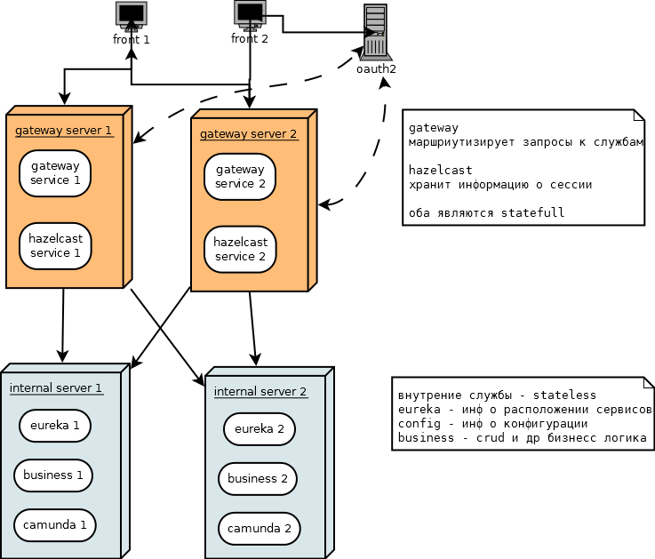

Схема сервисов
========================

Это упрощенная схема сервисов

На данной схеме выделяются несколько уровней

1. **front/external** - на данном уровне: 
   1. работают клиенты (browser - firefox/chrome)
   2. клиентам доступены сервера авторизации oauth - это может быть Windows AD/LDAP/и т.д. - которые поддерживают необходимый сетевой протокол (например oauth)
   3. клиентам доступены сервера gateway, которые расположены на уровне 2
   4. клиенты дальше 2-го уровня не имеют сетевого доступа
2. **gateway** - на данном уровне (2) располагаются сетевые сервисы
   1. **zuul** - производит 
      1. проверку прав и заворачивает левые запросы обратно
      2. валидные запросы пропускает дальше (маршрутизирует в зависимости от требуемой службы)
      3. Содержит в себе компонент - *hazelcast* - сетевой сервис, для распределенных-кластерных (in-memory) структур данных.
   2. **Hazelcast** - сетевой сервис в составе *ppa-gateway*
      1. Хранит в себе информацию о сеансе пользователя (сессия)
      2. Умеет ее реплицировать для высокой доступности - High Availability/HA
   3. Данный уровень и его сетевые сервисы предназачены
      1. Обеспечение безопастности - не пропустить не авторизованные запросы
      2. Обеспечить масштабирование по горизонтали (увеличение кол-ва gateway server)
      3. **StateFull** - Сервисы данного уровня критичны к перезапуску
3. **internal** - уровень (3) внутренних сервисов
   1. Сервисы
      1. **eureka** - кластер расположения сетевых служб
      2. **config server** - сервис(ы) конфигурации
      3. **business** - сервисы бизнес процессов
   2. Назначение и характеристики
      1. Обпеспечение бизнесс процессов
      2. **StateLess** - сервисы данного уровня не должны быть критичны к перезапуску

Модели отказов системы
===============================

Исходим из того что любой из серверов содержащий сервисы может иметь следующие проблемы

- Отказ оборудования (сеть/диск/память/cpu/....)
- Спад производительности, по причине достижения пределов

Для обеспечения доступности работы системы предполагается следующие стратегии

- Резервирование дополнительных мощностей - дублирование обсулживающих серверов
- Распределение нагрузки
- Резервное копирование данных

Сценарий 1 - отказ сервисов уровня 3 (business)
=====================================================

